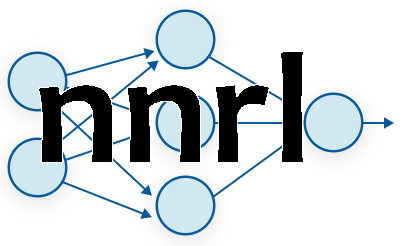

# nnrl (Neural network with reinforcement learning)


Neural network and reinforcement learning implementation in JS.\
Developing phase.

## Methods overall
### Neural network
#### This set of methods is what you will use to create and use the neural network.
```constructor```\
Initialize the model and set the learning rate to its default value.\
No inputs or outputs.

```add_layer```\
Add a neuron layer to the model.\
Inputs: neurons = number of neurons in that layer (must be > 0), activ_func = a string that contain the name of the activation function used to activate that layer(must be one of these: "none", "relu", "softplus", "sigmoid", "tanh", "softmax"). 

```set_learning_rate```\
Change the learning rate of the model if the number given is > 0.\
Input: a real number. Output: true if the input is positive and the learning rate is being changed, false otherwise.

```guess``` Return a guess based on the input vector given using forward propagation.\
Input: 1D vector.\
Output: 1D vector.

```backprop``` TODO

### Activation functions
#### A bunch of activation functions (funny stuff here), their derivatives and the functions to apply them.
```activate``` Apply the activation function to the layer. Input: x = the vector containing the layer to modify, i = the number of the layer (0 = input layer, ...).

#### All the activation functions take as input a vector and modify it.
```relu``` ReLU (Rectified Linear Unit). output = max(0, input). Input: 1D vector.

```softplus``` Smooth version of ReLU. output = ln(1 + exp(input)). Input: 1D vector.

```sigmoid``` Sigmoid function used to scale values in the range = (0, 1). output = 1 / (1 + exp(-input)). Input: 1D vector.

```tanh``` Hyperbolic tangent function used to scale values in the range = (-1, 1). output = sinh(input)/cosh(input) = (exp(input) - exp(-input)) / (exp(input) + exp(-input)). Input: 1D vector.

```softmax``` Normalized exponential function also known as softargmax, used to normalize the values to a probability distribution with exponential proportional weight. Input: 1D vector.

#### All the derivatives of the activation functions take as input a vector (ALREADY ACTIVATED with the same activation function) and return another vector as result.
```der_relu``` Derivative of ReLU. output = 0 if input <= 0, 1 otherwise. Input: 1D vector. Output: 1D vector.

```der_softplus``` Derivative of softplus. output = 1 - 1/exp(input).  Input: 1D vector. Output: 1D vector.

```der_sigmoid``` Derivative of sigmoid. output = input*(1 - input). Input: 1D vector. Output: 1D vector.

```der_tanh``` Derivative of hyperbolic tangent. output = 1 - input^2. Input: 1D vector. Output: 1D vector.

```der_softmax``` Derivative of softmax. For more detailed info search online. Input: 1D vector. Output: 1D vector.

### Random generators
#### Methods used to set up the weights of the model to random values generated accordingly to "Xavier initialization" and "He initialization".
```rand``` Generate a 2D matrix with random values picked from a normal distribution. Input: row = number of rows of the matrix, col = number of columns of the matrix, mean = mean of the distribution, variance = variance of the distribution (variance = stdev ^ 2). Output: 2D matrix.

```norm_distr``` Generate a number from a normal distribution. Input: mean = mean of the distribution, stdev = standard deviation of the distribution (stdev = sqrt(variance)). Output: a real value number.

### Linear algebra
#### A bunch of vector and matrix operation used in the neural network (nothing funny here XD).
```vec_sum``` Sum two vectors without modifying them and return a vector containing the result. Input: two 1D vectors. Output: 1D vector.

```mat_sum``` Sum two matrices without modifying them and return a matrix containing the result. Input: two 2D matrices. Output: 2D matrix.

```vec_sumTo``` Sum the second vector to the first one, the first vector is therefore modified. Input: two 1D vectors.

```mat_sumTo``` Sum the second matrix to the first one, the first matrix is therefore modified. Input: two 2D matrices.

```vec_sub``` Subtract two vectors without modifying them and return a vector containing the result. Input: two 1D vectors. Output: 1D vector.

```mat_sub``` Subtract two matrices without modifying them and return a matrix containing the result. Input: two 2D matrices. Output: 2D matrix.

```vec_subTo``` Subtarct the second vector to the first one, the first vector is therefore modified. Input: two 1D vectors.

```mat_subTo``` Subtract the second matrix to the first one, the first matrix is therefore modified. Input: two 2D matrices.

```vec_kmult``` Multiply the whole vector to the real number given, it modifies the vector. Input: k = real number, v = 1D vector.

```mat_kmult``` Multiply the whole matrix to the real number given, it modifies the matrix. Input: k = real number, m = 2D matrix.

```dotmm``` Dot product between two matrices (m1 x m2). Input: two 2D matrices. Output: 2D matrix.

```dotvm``` Dot product between a vector and a matrix (v x m). Input: v = 1D vector, m = 2D matrix. Output: 1D vector.

```dotvv``` Dot product between two vectors (v1 x v2). Input: two 1D vectors. Output: real number.

```transpose``` Transpose a 2D matrix modifying it. Input: 2D matrix.
